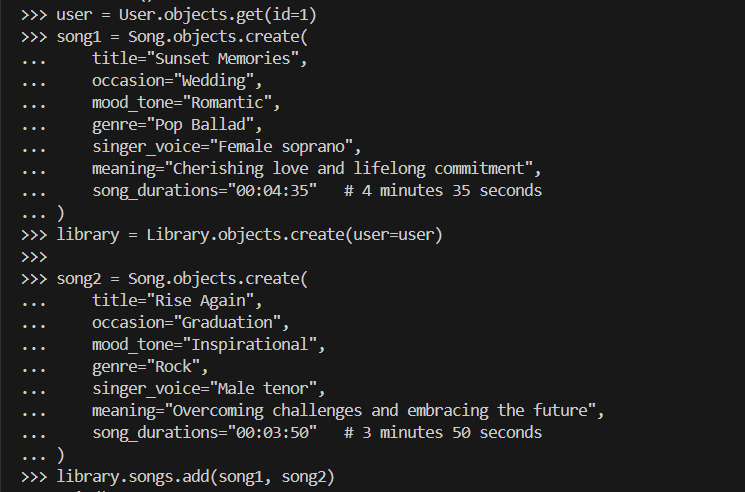
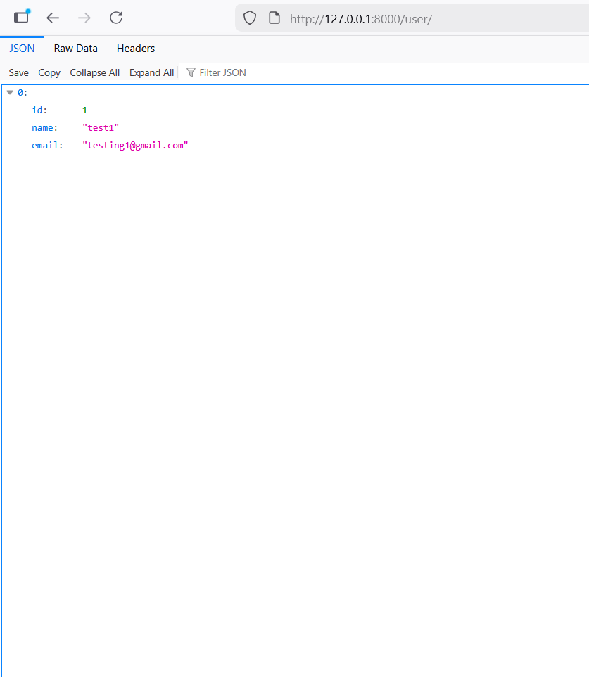
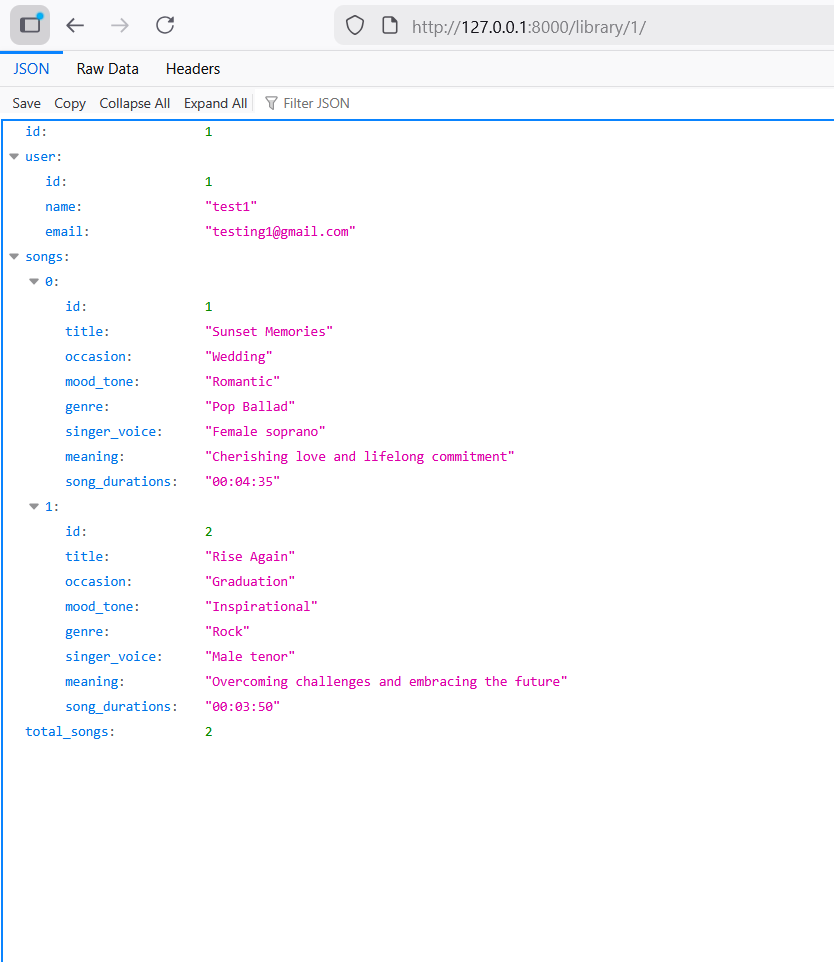
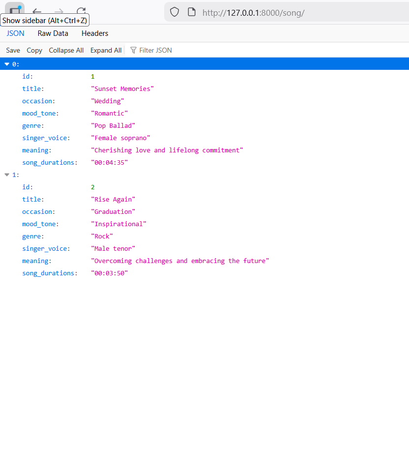
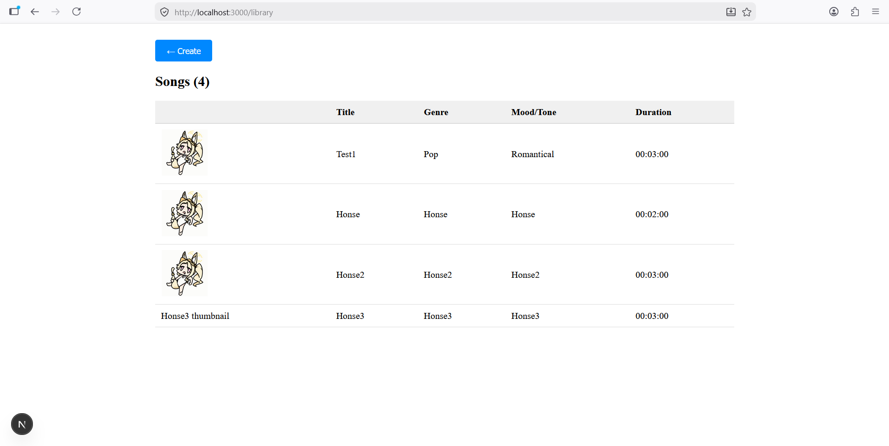
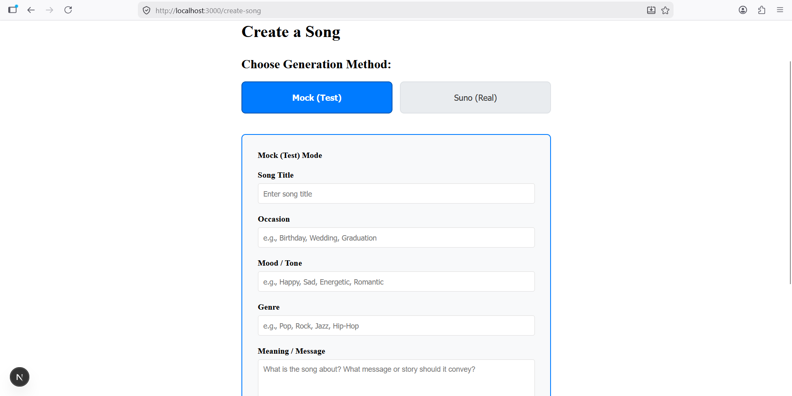
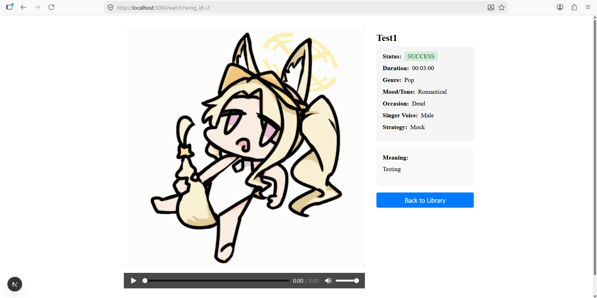

# Backend (Django)
## How to run/install


### 1. create python enviroment in backend directory.
```python
python -m venv .venv 
```

".venv" is environment directory name.


### 2. activate environment in terminal.
For window:
```python
.\.venv\Scripts\activate
```
For linux/mac
```python
source venv/bin/activate
```
in command prompt  
"(.venv) PS D:\directory>" should show up like this.


### 3. get into backend directory.
```python
cd backend
```


### 4. install the requirements.
```python
pip install -r .\requirements.txt
```

if some still missing after try running server, use this.

```python
python -m pip install ...
```


### 5. migrate the sqlite3.
make tables for sqlite3.
```bash
python manage.py migrate 
```

### 5.5. Set up environment variables (optional for Suno API).
Copy `backend/.env.example` to `backend/.env` and fill in your actual values, such as the Suno API token.

See [backend/.env.example](backend/.env.example) for details.


### 6. run the testing server.
make sure you're in the same directory as manage.py, in this case is backend.
```bash
python manage.py runserver 
```


# Frontend (Next.js)
## How to run/install

### 1. Ensure Node.js is installed.
Download and install Node.js from [nodejs.org](https://nodejs.org/). This includes npm.

### 2. Get into frontend directory.
```bash
cd frontend
```

### 3. Install the dependencies.
```bash
npm install
```

### 4. Run the development server.
```bash
npm run dev
```

The frontend should now be running on `http://localhost:3000` (or the port specified in next.config.ts).


## Demo Screenshots

Inserting Data into Tables


User Tables


Library Tables


Song Tables


library_song


generate_song


watch_song



$${\color{white}End}$$
